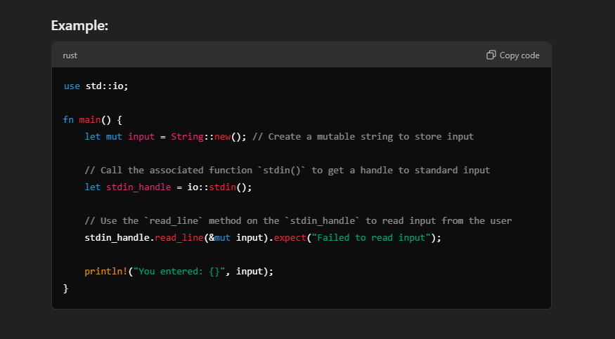

# Simple-Rust-Guessing-Game

This Project is from Rust Book and is used by me to learn Rust.

## Learning One

1. To take input from the command line we use the `std::io` library
   Command : `use std::io;`
2. The io library comes from the standard library, known as `std:`
3. If a type you want to use isn’t in the prelude, you have to bring that type into scope explicitly with a `use` statement.
4. Using the std::io library provides you with a number of useful features, including the ability to accept user input.
5. `String` is a string type provided by the standard library that is a growable, UTF-8 encoded bit of text.

## Learning Two

1. The `::` syntax in the `::new` line indicates that **new is an associated function of the String type**. An associated function is a function that’s implemented on a type, in this case String. This new function creates a new, empty string. You’ll find a new function on many types because it’s a common name for a function that makes a new value of some kind.
2. In full, the `let mut guess = String::new();` line has created a mutable variable that is currently bound to a new, empty instance of a String.

## Learning Three

1. Call the stdin function from the io module, which will allow us to handle user input:

### **NOTE**

`    If we hadn’t imported the io library with use std::io; at the beginning of the program, we could still use the function by writing this function call as std::io::stdin. The stdin function returns an instance of std::io::Stdin, which is a type that represents a handle to the standard input for your terminal.`

### Associated Function

An associated function is a function that’s implemented on a type

In the `String::new()` `new` is a associated function whereas the `io` in `std::io` is a _`module`_.

The .expect("Failed to read line"); in Rust is a method call on the **`Result type`**. Here's a detailed breakdown:

Context:
The read_line method from std::io::Stdin returns a `Result type`, which is an enum that can either:

Be `Ok(value)` if the operation was successful, or
Be `Err(error)` if the operation failed.

The `.expect()` method is a convenient way to handle the Result type. It:

1. Unwraps the Result: If the Result is Ok(value), it extracts the value.
2. Panics on Error: If the Result is Err(error), it terminates the program and prints the provided error message (in this case, "Failed to read line").

**A namespace provides a container to hold things like functions, classes and constants as a way to group them together logically and to help avoid conflicts with functions and classes with the same name that have been written by someone else.**

**The `::` syntax is used in Rust for path resolution. It helps access items within a module, trait, or namespace**

https://chatgpt.com/share/677a9bcb-6dd0-8005-95ed-f23234ad3b29

1. std is a Library
   1. The Standard Library is a precompiled collection of foundational utilities and tools provided by Rust.
   2. It contains many modules (e.g., io, fs, thread) that group related functionality.
2. io is a Module Inside std
   1. std::io is one of the modules in the std library.
   2. It provides functionality related to input and output, such as reading from the console, writing to files, and working with streams.
3. stdin() is an Associated Function
   1. What is an Associated Function?
      It’s a function that is associated with a type but is not tied to a specific instance of that type.
      It’s called directly on the type, not on an instance.
   2. Where Does stdin() Belong?
      stdin() is an associated function of the std::io module. Specifically, it returns a handle to the standard input (std::io::Stdin), which is an object used for reading user input.

## NOTE

The `.read_line(&mut guess)` always appends to the existing string

**_references are immutable by default. Hence, you need to write `&mut guess` rather than &guess to make it mutable._**

**`read_line` puts whatever the user enters into the string we pass to it, but it also returns a `Result` value. `Result` is an `enumeration`, often called an `enum`, which is a type that can be in one of multiple possible states. We call each possible state a `variant`.**

**The Purpose of the `Result` types is to encode error-handling information**
**Result’s variants are `Ok` and `Err`.**

Values of the Result type, like values of any type, have methods defined on them. An instance of Result has an expect method that you can call. If this instance of Result is an Err value, expect will cause the program to crash and display the message that you passed as an argument to expect. If the read_line method returns an Err, it would likely be the result of an error coming from the underlying operating system. If this instance of Result is an Ok value, expect will take the return value that Ok is holding and return just that value to you so you can use it. In this case, that value is the number of bytes in the user’s input.

If you don’t call expect, the program will compile, but you’ll get a warning

## WHAT IS A CRATE ?

**A `crate` is a collection of Rust source code files.** The project we’ve been building is a `binary crate`, which is an executable. The `rand crate` is a `library crate`, which contains code that is intended to be used in other programs and can’t be executed on its own.
